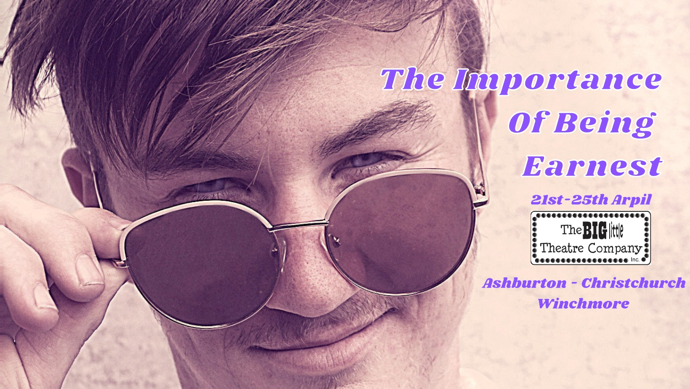

# About the Show

So what is the show about you ask? It’s a comedy of falsehoods, wit and questionable societal norms, Big Little Theatre Company's reimagining of Oscar Wilde's the Importance of Being Earnest will have you laughing out loud and hungry for a muffin.
Jack is in love with Gwendolen. Algernon is in love with Cecily. Cecily is Jack's ward. Gwendolen is Algernon's cousin. Jack told Gwendolen his name was Ernest. Algernon told Cecily his name was Ernest. Neither Jack nor Algernon are actually called Ernest but of course Gwendolen and Cecily both think their love is called Ernest. Maddie and Morgan can't find Ernest anywhere on Instagram, someone misplaced a baby and Quin is just happy to be here.
Confused? Good. You’ll just have to come along for a fun filled evening out to make sense of just who Ernest is and why he is so important.

## Performances

All Performaces are at 7:30pm.
Tickets are $20 Adults / $15 Chile

21/04: ASHBURTON EVENTS CENTRE:  [Book Tickets](ateventcentre.co.nz)

22/4: LITTLE ANDROMEDA, CHRISTCHURCH: [Book Tickets](Littleandromeda.co.nz)

23/04:  ISAAC ROYAL, CHRISTCHURCH: [Book Tickets](Eventbrite.co.nz)

24/04:  WINCHMORE HALL, Door Sales Only.

!(bltc)[bltc.jpg]
